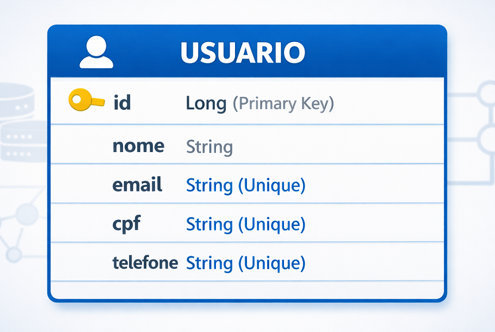
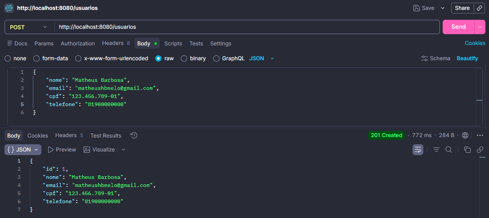
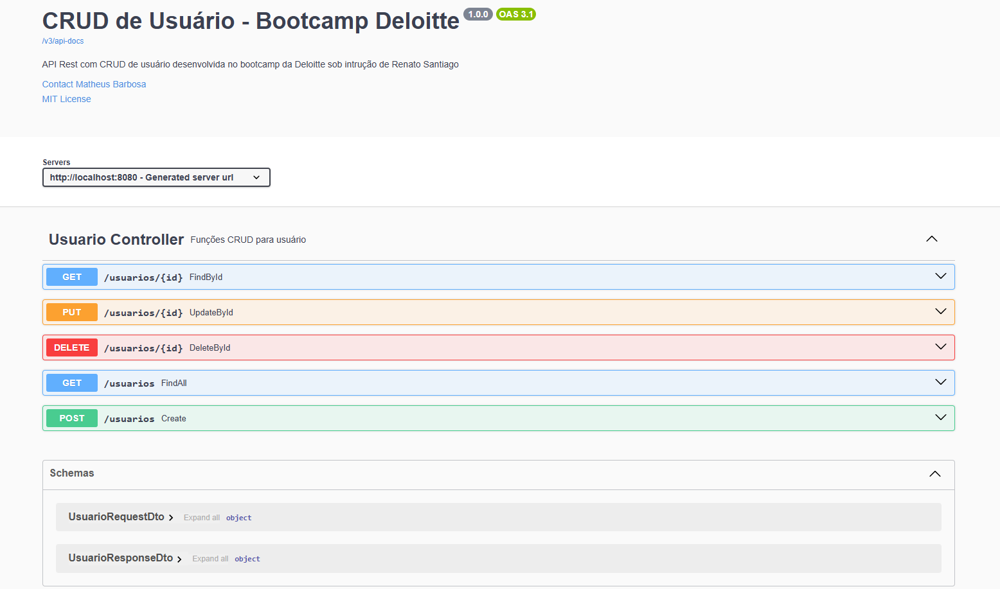
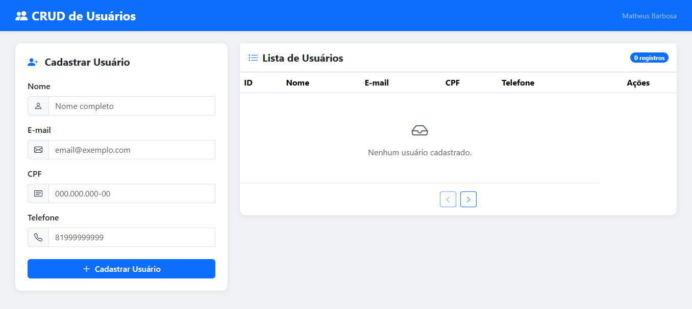

# **👥 CRUD de Usuários - Bootcamp Deloitte**

## **📌 Descrição do Projeto**
Esta é uma API REST para gerenciamento de usuários (CRUD), desenvolvida em Java com o framework Spring Boot. A aplicação implementa as operações fundamentais de criação, consulta, atualização e exclusão de registros.

O projeto demonstra a transição de uma aplicação Java convencional para uma arquitetura em camadas moderna. Ele destaca competências em desenvolvimento backend, incluindo persistência de dados, documentação de endpoints e implementação de testes unitários.

---

## **📑 Índice**
- [Tecnologias Utilizadas](#tecnologias-utilizadas)
- [Funcionalidades](#-funcionalidades)
- [Como Executar](#-como-executar)
    - [Pré-requisitos](#pré-requisitos)
    - [Instalação](#instalação)
    - [Executando o Projeto](#executando-o-projeto)
- [Banco de dados](#-banco-de-dados-database)
- [Endpoints da API](#-endpoints-da-api)
- [Documentação da API](#-documentação-da-api)
- [Testes unitários](#-testes-unitários)
- [Licença](#-licença)
- [Autor](#-autor)

---

## **💻Tecnologias Utilizadas**
- **Java 17**
- **Spring Boot 4.0.3**
    - Spring Web
    - Spring Boot DevTools
    - Spring Data JPA
- **H2 Database** como banco de dados relacional
- **JUnit 5** e **Mockito** para testes
- **Springdoc OpenAPI** para documentação da API (Swagger UI)
- **Maven** como gerenciador de dependências
- **Lombok** para reduzir boilerplate de código

---

## **🚀 Funcionalidades**
1. **Usuário**
    - Criar novo usuário;
    - Buscar usuário por ID;
    - Buscar todos os usuários;
    - Editar usuário por ID;
    - Excluir usuário por ID.


2. **Testes (Branch separada de testes)**
    - Testes unitários para validação das regras de negócio do Service e Controller.


3. **Documentação da API (Em desenvolvimento)**
    - Documentação gerada pelo Springdoc OpenAPI, acessível via Swagger UI.
    - README do projeto no GitHub.

---

## **🛠️ Como Executar**

### **Pré-requisitos**
Antes de começar, certifique-se de ter instalado:
- **Java 17**
- **Maven**
- Uma IDE como **IntelliJ IDEA** ou **Eclipse**

### **Instalação**
1. Clone este repositório:
```bash
   git clone https://github.com/MatheusHBMelo/bootcamp-deloitte
   cd bootcamp-deloitte
```
2. Configure o banco de dados H2Database:

-   Atualize as credenciais no arquivo `application.properties`.

```properties
    # 1. H2 Console (Acesse em: localhost:8080/h2-console)
    spring.h2.console.enabled=true
    spring.h2.console.path=/h2-console

    # 2. Conexão do Banco de Dados
    spring.datasource.url=jdbc:h2:mem:usuarioApiDB
    spring.datasource.driverClassName=org.h2.Driver
    spring.datasource.username=user
    spring.datasource.password=admin

    # 3. JPA / Hibernate
    spring.jpa.database-platform=org.hibernate.dialect.H2Dialect
    spring.jpa.hibernate.ddl-auto=update
    spring.jpa.show-sql=true
```
3. Compile o projeto:

```bash
   mvn clean install
```

### Executando o Projeto

- Inicie o servidor Spring Boot:

```bash
   mvn spring-boot:run
```
- A aplicação estará disponível em: http://localhost:8080

## **🗄️ Banco de dados (Database)**

- Por orientação do instrutor, esse projeto utiliza o H2 Database, um banco de dados em memória.



- O banco de dados possui uma interface interativa disponível em: http://localhost:8080/h2-console

## **📍 Endpoints da API**

#### **Usuario**

-   `POST /usuarios`: Criação de usuários (salva no banco de dados).
-   `GET /usuarios`: Busca todos os usuários.
-   `GET /usuarios/id`: Busca um usuário pelo ID.
-   `PUT /usuarios/id`: Atualiza um usuário pelo ID.
-   `DELETE /usuarios/id`: Deleta um usuário pelo ID.

#### **Postman API Test**



## **📝 Documentação da API**

#### A aplicação está documentada com o auxilio do **Swagger UI**


- A documentação está disponível em: http://localhost:8080/swagger-ui/index.html

## **🧪 Testes unitários**

Antes de começar, verifique o guia de testes:
- **Branch Master**: Contém apenas os testes de fluxo de criação do usuário (OBS: Solicitação do instrutor);
- **Branch Test**: Contém cobertura de 100% dos testes unitários da camada Controller e Service.

**O código presente na branch de test não está atualizado com os commits de aplicação do SOLID da branch master, portanto se você fizer o merge das duas branchs ocorrerá falhas nos testes.**

## **📊 Frontend da aplicação**

O frontend da aplicação foi criado em:
- **HTML**: Para estruturar as seções da pagina.
- **Bootstrap**: Para fornecer os templates html e css.
- **Alpine.JS**: Para realizar a lógica de programação da conexão front-back;


- O frontend está disponível em: http://localhost:8080


## **🚔 Licença**

Este projeto está licenciado sob a Licença MIT.

----------

## **👨‍💻 Autor**

-   [LinkedIn](https://www.linkedin.com/in/matheushbmelo)
-   [GitHub](https://github.com/MatheusHBMelo)

**Desenvolvido por Matheus Barbosa**